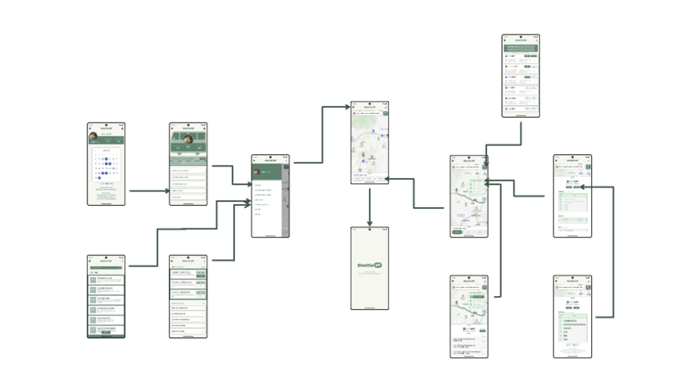
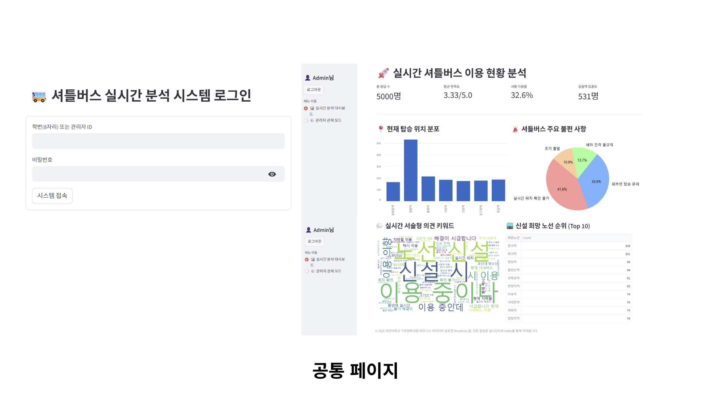
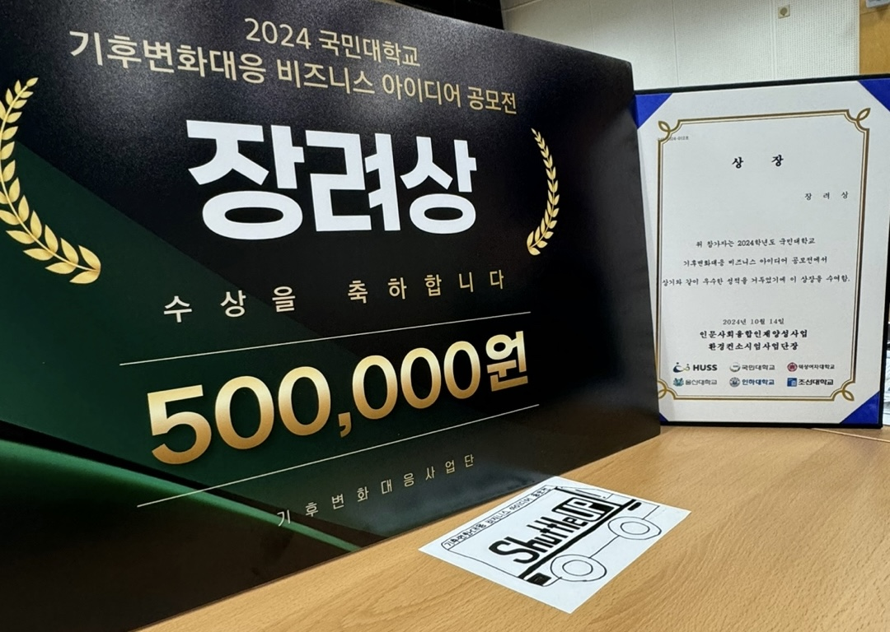

# 🚍 Sustainable Shuttle — WordCloud Pipeline
> 2024 국민대학교 기후변화대응 비즈니스 아이디어 공모전 – **장려상** 🏆  
> “셔틀/교통/지속가능성” 관련 텍스트 데이터를 **실시간 파이프라인으로 수집·처리하고 워드클라우드로 시각화**하는 프로젝트

<p align="center">
  
</p>

<p align="center">
  <a href="#"></a>
  <a href="#"></a>
  <a href="#"></a>
</p>

---

## ✨ What this does
이 프로젝트는 **Producer → Consumer → Web(App)** 구조로 텍스트를 흘려보내고, 이를 **WordCloud로 변환**해 결과를 보여줍니다.

- **Producer (`producer.py`)**: 텍스트(키워드/문장/댓글 등) 생성·전송
- **Consumer (`consumer.py`)**: 수신한 텍스트를 누적/전처리 → 워드클라우드 생성
- **Web App (`app.py`)**: 생성 결과(이미지/상태)를 웹에서 확인
- **Docker Compose (`docker-compose.yml`)**: 전체를 한 번에 실행

> 레포 구성: `app.py`, `producer.py`, `consumer.py`, `docker-compose.yml`, `requirements.txt`, `images/` :contentReference[oaicite:1]{index=1}

---

## 🧠 Architecture
```text
[Producer]  --->  (message queue / stream)  --->  [Consumer]  --->  wordcloud.png
                                         |
                                         +-------------------->  [Web App]
```

<p align="center">
  
</p>

<p align="center">
  
</p>

---

## 🏆 Archievements
<p align="center">
  
</p>